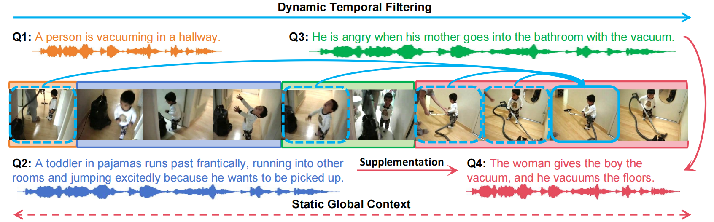
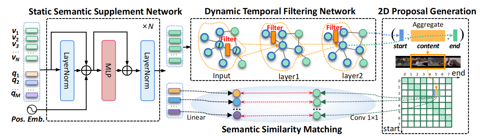

# Unified Static and Dynamic:Temporal Filtering Network for Efficient Video Grounding


> Jingjing Hu, Dan Guo, Kun Li, Zhan Si, Xun Yang, Xiaojun Chang and Meng Wang

> Hefei University of Technology

##### [Arxiv](https://arxiv.org/abs/xxxx)


**Task Example:** Video grounding task (query: text or audio). The video is described by four queries (events), all of which have separate semantic context and temporal dependency. Other queries can provide global context (antecedents and consequences) for the current query (e.g. query Q4). Besides, historical similar scenarios (such as in blue dashed box) help to discover relevant event clues (time and semantic clues) for understanding the current scenario (blue solid box).

<p align="center">
 
</p>

## Approach

The architecture of the UniSDNet. It mainly consists of static and dynamic networks: Static Semantic Supplement Network (S3Net) and Dynamic Temporal Filtering Network (DTFNet). S3Net concatenates video clips and multiple queries into a sequence and encodes them through a lightweight single-stream ResMLP network. DTFNet is a 2-layer graph network with a dynamic Gaussian filtering convolution mechanism, which is designed to control message passing between nodes by considering temporal distance and semantic relevance as the Gaussian filtering clues when updating node features. The role of 2D temporal map is to retain possible candidate proposals and represent them by aggregating the features of each proposal moment. Finally, we perform semantic matching between the queries and proposals and rank the best ones as the predictions.

<div align="center">
  
</div>

----------
## To be updated
- [x] : Upload instruction for dataset download
- [x] : Upload implementation
- [ ] : Update training and testing instructions
- [ ] : Update trained model


----------

## Download and prepare the datasets

**1. Download the datasets.**
   
* The [video feature](https://rochester.app.box.com/s/8znalh6y5e82oml2lr7to8s6ntab6mav)  provided by [2D-TAN](https://github.com/microsoft/2D-TAN)
    
        ActivityNet Captions C3D feature
        Charades-STA VGG feature
        TACoS C3D feature

    
* The video I3D feature of Charades-STA dataset from [LGI](https://github.com/JonghwanMun/LGI4temporalgrounding)
     
        wget http://cvlab.postech.ac.kr/research/LGI/charades_data.tar.gz
        tar zxvf charades_data.tar.gz
        mv charades data
        rm charades_data.tar.gz


* The video C3D feature of Charades-STA dataset from [DRN](https://github.com/Alvin-Zeng/DRN)
    
        https://pan.baidu.com/s/1Sn0GYpJmiHa27m9CAN12qw
        password:smil

* The Audio Captions: ActivityNet Speech Dataset: download the [original audio](https://drive.google.com/file/d/11f6sC94Swov_opNfpleTlVGyLJDFS5IW/view?usp=sharing) proposed by [VGCL](https://github.com/marmot-xy/Spoken-Video-Grounding)

* The Audio Captions: Charades-STA Speech Dataset: download the [original audio](https://zenodo.org/record/8019213) proposed by us.

* The Audio Captions: TACoS Speech Dataset: download the [original audio](https://zenodo.org/record/8022063) proposed by us. 

**2. Prepare the files in the following structure.**
   
      UniSDNet
      ├── configs
      ├── dataset
      ├── dtfnet
      ├── data
      │   ├── activitynet
      │   │   ├── *audio features
      │   │   └── *c3d features
      │   ├── charades
      │   │   ├── *audio features
      │   │   ├── *vgg features
      │   │   ├── *c3d features
      │   │   └── *i3d features
      │   └── tacos
      │       ├── *audio features
      │       └── *c3d features
      ├── train_net.py
      ├── test_net.py
      └── ···


## Dependencies

    pip install yacs h5py terminaltables tqdm librosa transformers
    conda install pytorch==1.11.0 torchvision==0.12.0 torchaudio==0.11.0 cudatoolkit=11.3 -c pytorch
    conda config --add channels pytorch
    conda install pytorch-geometric -c rusty1s -c conda-forge


## Training
### Charades-STA
For training, run the shell below:
```
bash  
bash   
```

### TACoS
For training, run the shell below:
```
bash   
```

## Testing
Our trained model are provided in [baiduyun, passcode:xmc0](xx) or [Google Drive](xx). Please download them to the `checkpoints/best/` folder.
Use the following commands for testing:
- For TACoS dataset, run: 
```bash
    sh test_tacos.sh
```
- For ActivityNet-Captions dataset, run:
```bash
    sh test_activitynet.sh
```
- For Charades-STA dataset, run:
```bash
    sh test_charades.sh
```

## Main results:

| **TACoS** | Rank1@0.3 | Rank1@0.5 | Rank5@0.3 | Rank5@0.5 |
| ---- |:-------------:| :-----:|:-----:|:-----:|
| **RaNet** |  x | x |  x | x |
</br>

| **ActivityNet** | Rank1@0.5 | Rank1@0.7 | Rank5@0.6 | Rank5@0.7 |
| ---- |:-------------:| :-----:|:-----:|:-----:|
| **RaNet** | x | x | x | x |
</br>

| **Charades (VGG)**  | Rank1@0.5 | Rank1@0.7 | Rank5@0.5 | Rank5@0.7 |
| ---- |:-------------:| :-----:|:-----:|:-----:|
| **RaNet** | x | x | x | x |
</br>

| **Charades (I3D)**  | Rank1@0.5 | Rank1@0.7 | Rank5@0.5 | Rank5@0.7 |
| ---- |:-------------:| :-----:|:-----:|:-----:|
| **RaNet** | x | x | x | x |

## 📖 BibTeX 
If you find the repository or the paper useful, please use the following entry for citation.
```
@article{unified2024hu ,
  title={Unified Static and Dynamic Network: Efficient Temporal Filtering for Video Grounding},
  author={Hu, Jingjing and Guo, Dan and Li, Kun and Si, Zhan and Yang, Xun and Chang, Xiaojun and Wang, Meng},
  journal={arXiv preprint arXiv:xxx},
  year={2024}
}
```

## ☎️ Contributors and Contact
If there are any questions, feel free to contact the author: Jingjing Hu (xianhjj623@gmail.com)

## ☑️ LICENSE
The annotation files and many parts of the implementations are borrowed from [MMN](https://github.com/MCG-NJU/MMN).
Our codes are under [MIT](https://opensource.org/licenses/MIT) license.

